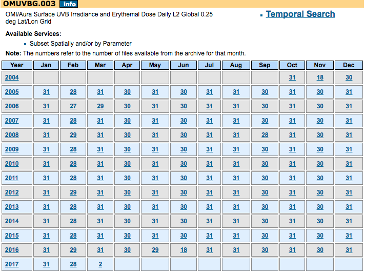

A way to download [Level-2 OMI Surface UV Irradiance and Erythemal Dose](https://disc.gsfc.nasa.gov/Aura/data-holdings/OMI/omuvbg_v003.shtml) from NASA.

# About the Data

Data is stored in ~9005 files, some are `.he5` (`hdf`) data files and others are matching `.xml` metadata files.

## More Details from [Source](https://disc.gsfc.nasa.gov/Aura/data-holdings/OMI/omuvbg_v003.shtml)

*__Note__: File Size(Approx) is approximate size per data file.  Current is Mar 4, 2017.  The weekly update had not been uploaded yet, so at the time this script was written, last day of data downloaded was from Feb 28, 2017.*

(currently FMI is delivering data on weekly basis)

| Version | Begin Date  | End Date |
| ------- |:-----------:| --------:|
| 003     | Oct 2, 2004 | Current  |

Production Frequency: 14 files/day
Granule (File) Coverage: one orbit
File Size(Approx): 130 MB

# Steps to Run Download

1. [Register With Earthdata Login](https://wiki.earthdata.nasa.gov/display/EL/How+To+Register+With+Earthdata+Login)
1. [Authorize NASA GESDISC DATA ARCHIVE in Earthdata Login](https://disc.gsfc.nasa.gov/registration/authorizing-gesdisc-data-access-in-earthdata_login)
1. Clone or download this repo

  ```bash
  git clone https://github.com/sketch-city/nasa-uv-data-downloader.git
  ```

1. Then run the script:

  ```bash
  ./nasa-uv-data-downloader/script.sh -u <username> -p <password>
  ```
  where `<username>` and `<password>` are from Step 1, the Earthdata login.

  You can also add a `-d` option for date.  `-d` can be any of the following:
  `2017`
  `201702`
  `20170201`
  or any other date string in the `YYYY`, `YYYYMM`, or `YYYYMMDD` format.

  By default, both `.he5` data and the corresponding `.xml` data will be downloaded.  You can add a `--without-meta` flag or `--without-data` flag to the command as needed.

# More Info

## About

* https://mirador.gsfc.nasa.gov/cgi-bin/mirador/collectionlist.pl?keyword=omuvbg
* https://disc.gsfc.nasa.gov/uui/datasets/OMUVBG_V003/summary
* https://acdisc.gesdisc.eosdis.nasa.gov/opendap/HDF-EOS5/Aura_OMI_Level2G/OMUVBG.003/contents.html
* https://mirador.gsfc.nasa.gov/cgi-bin/mirador/granlist.pl?page=1&dataSet=OMUVBG&version=003&allversion=003&keyword=omuvbg&pointLocation=(-90,-180),(90,180)&location=(-90,-180),(90,180)&searchType=Location&event=&startTime=2004-10-01&endTime=2017-03-04%2023:59:59&search=&CGISESSID=a6a5b3aeb7fd6ba229f02f71d56dfaa1&nr=4502&temporalres=1%20day&prodpg=http://disc.gsfc.nasa.gov/datacollection/OMUVBG_V003.html&longname=OMI/Aura%20Surface%20UVB%20Irradiance%20and%20Erythemal%20Dose%20Daily%20L2%20Global%20Gridded%200.25%20degree%20x%200.25%20degree%20V3&granulePresentation=ungrouped



## Papers?

* [Surface ultraviolet irradiance from OMI](http://ieeexplore.ieee.org/document/1624605/)
* [Solar Erythemal Daily Dose Distributions Maps over Peninsular Malaysia Obtained By Ozone Monitoring Instrument](http://www.ipcbee.com/vol8/50-S20008.pdf)
* [Validation of daily erythemal doses from Ozone Monitoring Instrument with ground-based UV measurement data](http://onlinelibrary.wiley.com/doi/10.1029/2007JD008830/full)
